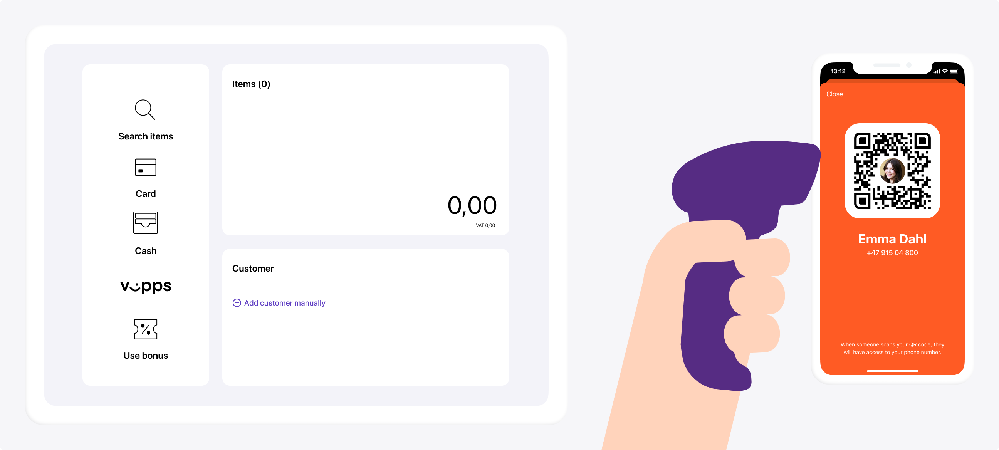

<!-- START_METADATA
---
title: Checklist
sidebar_position: 10
---
END_METADATA -->

# How it works

💥 DRAFT! Unfinished work in progress. API specification changes are still coming. 💥

## Step 1: Scan the QR code

The flow begins with the customer presenting their QR code to the merchant. This can happen two ways:

* Customer-facing scanner. The store will have a permanent customer-facing scanner and customers can scan their QR code at any time.
* The QR code is scanned by the cashier using a wired scanner. This could happen while the cashier is scanning wares or right before the payment.

## Step 2: Check membership

Check the customer's membership status by using the mobile number you received in the last step.

Automatically trigger a Vipps Check-In to inform the customer whether or not they are a member of your loyalty program. This will help them through the payment process.

