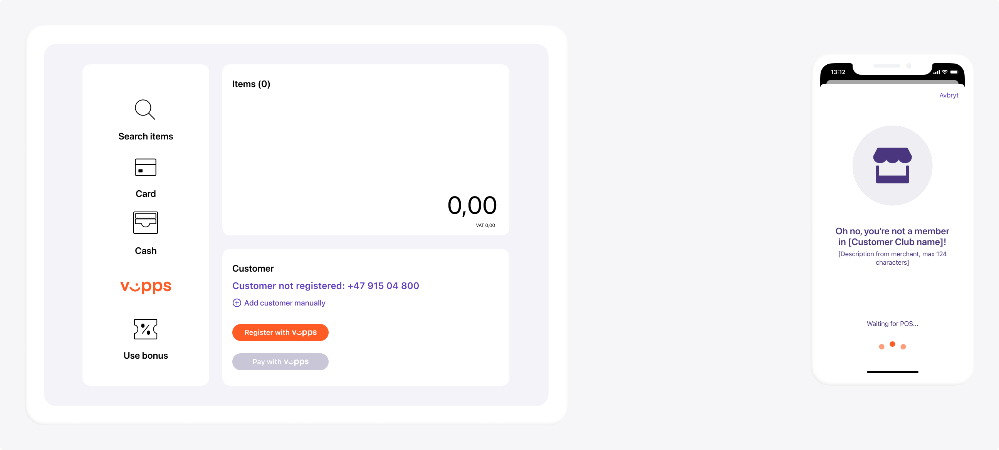

<!-- START_METADATA
---
title: How the Check-in API works
sidebar_label: How it works
sidebar_position: 10
description: View Check-in how-it-works guide for illustrations of the main flow.
pagination_next: null
pagination_prev: null
---
END_METADATA -->

# How the Check-in API works

To get an impression of how the check-in functionality looks and feels, check out the member flow in the
[demoshop](https://demo.vipps.no/member-flow).

## Step 1: Scan the QR code

The flow begins with the customer presenting their personal Vipps QR code to the merchant. This can happen two ways:

* Customer-facing scanner. The store will have a permanent customer-facing scanner and customers can scan their QR code at any time.
* The QR code is scanned by the cashier using a wired scanner. This could happen while the cashier is scanning wares or right before the payment.

## Step 2: Check membership

The customer's membership status is checked by using the mobile number received in the last step.

A Vipps Check-in API request is triggered to inform the customer whether or not they are a member of your loyalty program. This will help them through the payment process.

